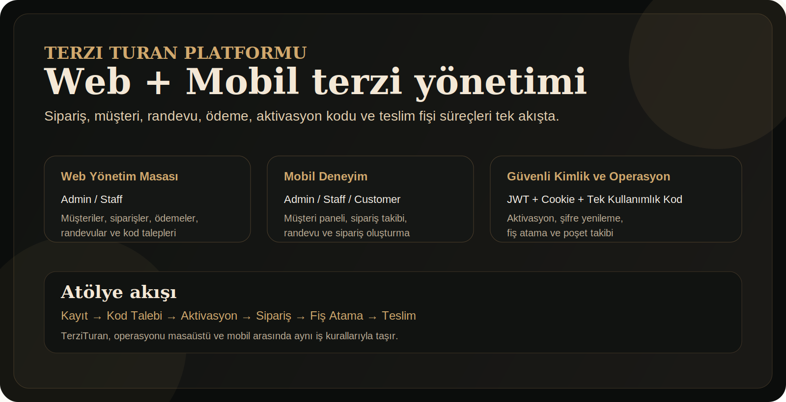
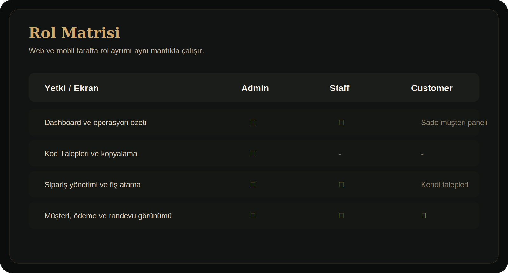
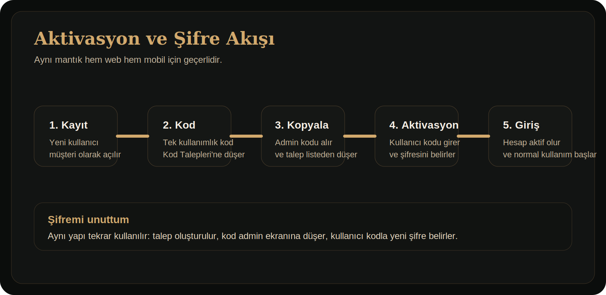

# TerziTuran

<p align="center">
  
</p>

<p align="center">
  Atölye operasyonu, müşteri yönetimi, sipariş takibi, randevular, ödemeler, poşet fişleri ve mobil erişimi tek yapıda birleştiren terzi yönetim platformu.
</p>

<p align="center">
  
</p>

## Genel Bakış

TerziTuran; terzi, modaevi ve konfeksiyon atölyeleri için geliştirilmiş tam yığın bir yönetim sistemidir. Proje iki ana parçadan oluşur:

- `TerziTuran.Web`: ASP.NET Core MVC arayüzü, JWT destekli API, SQLite veritabanı ve iş kuralları
- `TerziTuran.Mobile`: Flutter ile geliştirilmiş mobil istemci

Sistem; `Admin`, `Staff` ve `Customer` rollerini destekler. Yönetim tarafı atölye süreçlerini yönetirken, müşteri tarafı kendi sipariş, randevu ve hesap akışını görür.

## Öne Çıkan Yetenekler

- Rol bazlı erişim: `Admin`, `Staff`, `Customer`
- Web ve mobil için ortak iş kuralları
- JWT korumalı mobil API ve cookie tabanlı web oturumu
- Müşteri kayıt, aktivasyon kodu ve şifre sıfırlama akışı
- Admin için `Kod Talepleri` ekranı
- Sipariş, ödeme, randevu ve müşteri yönetimi
- Poşet adedi ve teslim fişi yönetimi
- Dashboard kartları ve operasyon özeti
- PDF rapor üretimi
- Docker ve Nginx ile deploy altyapısı

## Roller ve Deneyim

<p align="center">
  
</p>

### `Admin`

- Kullanıcı yönetimi yapar
- Kod taleplerini görür ve kopyalar
- Sipariş, ödeme, müşteri, randevu ve fiş süreçlerini yönetir

### `Staff`

- Atölye operasyonunu yürütür
- Sipariş, ödeme, müşteri ve randevu ekranlarını kullanır
- Fiş atama ve teslim süreçlerinde çalışır

### `Customer`

- Mobil ve web tarafında kendi ekranını görür
- Kendi siparişlerini ve randevularını takip eder
- Mobil üzerinden sipariş talebi oluşturabilir
- Aktivasyon ve şifre sıfırlama akışını tek kullanımlık kodla tamamlar

## Aktivasyon ve Kod Akışı

<p align="center">
  
</p>

Bu yapı hem webde hem mobilde aynıdır:

1. Yeni kullanıcı kaydı oluşturulur.
2. Sistem kullanıcıyı `Customer` rolüyle hazırlar.
3. Tek kullanımlık kod `Kod Talepleri` ekranına düşer.
4. Admin kodu kopyaladığında talep listeden kalkar.
5. Kullanıcı kodu girer, şifresini belirler ve hesabı aktif hale gelir.
6. `Şifremi unuttum` akışı da aynı mantıkla çalışır.

## Teknoloji Yığını

| Katman | Teknolojiler |
| --- | --- |
| Backend | ASP.NET Core 8, MVC, Web API, Entity Framework Core |
| Veritabanı | SQLite |
| Kimlik Doğrulama | Cookie Auth, JWT Bearer |
| Mobil | Flutter |
| Arayüz | Razor Views, Bootstrap 5 |
| Raporlama | QuestPDF |
| Dokümantasyon | Swagger / OpenAPI |
| Deployment | Docker Compose, Nginx |

## Proje Yapısı

```text
TerziTuran/
├── TerziTuran.Web/
│   ├── ApiControllers/
│   ├── Controllers/
│   ├── Data/
│   ├── DTOs/
│   ├── Extensions/
│   ├── Middleware/
│   ├── Migrations/
│   ├── Models/
│   ├── Services/
│   ├── ViewModels/
│   ├── Views/
│   └── wwwroot/
├── TerziTuran.Mobile/
│   ├── assets/
│   └── lib/
├── deployment/
├── docs/
│   └── images/
└── README.md
```

## Hızlı Başlangıç

### 1. Web uygulamasını çalıştır

```bash
cd TerziTuran.Web
dotnet restore
DOTNET_ROLL_FORWARD=Major dotnet ef database update
DOTNET_ROLL_FORWARD=Major dotnet run
```

Varsayılan geliştirme adresi genelde `http://127.0.0.1:5241` olur.

### 2. Mobil uygulamayı çalıştır

```bash
cd TerziTuran.Mobile
flutter pub get
flutter run
```

Farklı bir API adresi vermek istersen:

```bash
flutter run --dart-define=API_URL=https://api.example.com
```

### 3. Analiz ve doğrulama

```bash
cd TerziTuran.Web
dotnet build
```

```bash
cd TerziTuran.Mobile
flutter analyze
```

## Geliştirme Notları

- Bu ortamda .NET 10 runtime bulunduğu için `net8.0` proje çalıştırılırken `DOTNET_ROLL_FORWARD=Major` kullanılmıştır.
- Geliştirme ortamında Swagger açıktır.
- Uygulama başlangıcında migration’lar uygulanır.
- Siparişlerde `BagCount < 1` olan eski veriler başlangıçta `1` olarak düzeltilir.

## Varsayılan İş Akışları

### Sipariş ve fiş

- Siparişte `Poşet Adedi` seçilir.
- Fiş atanmamış siparişler `Fiş Atama Bekliyor` durumunda görünür.
- Aktif fiş oluşturulunca teslim numarası ve teslim alma kodu atanır.

### Müşteri kayıt akışı

- Yeni kayıt olan kullanıcılar otomatik `Customer` rolüyle oluşturulur.
- Kayıt sırasında doğrudan şifre alınmaz.
- Aktivasyon kodu girildikten sonra kullanıcı ilk şifresini belirler.

### Mobil müşteri deneyimi

- `Panelim`
- `Siparişlerim`
- `Randevularım`
- Sipariş oluşturma

## API Özeti

Tüm API cevapları aşağıdaki yapıyı döner:

```json
{
  "success": true,
  "message": "Mesaj",
  "data": {}
}
```

Başlıca uçlar:

- `POST /api/auth/login`
- `POST /api/auth/register`
- `POST /api/auth/activate`
- `POST /api/auth/forgot-password`
- `POST /api/auth/reset-password`
- `GET /api/dashboard/summary`
- `GET|POST|PUT|DELETE /api/orders`
- `GET|POST|PUT|DELETE /api/customers`
- `GET|POST|PUT|DELETE /api/appointments`
- `GET|POST|PUT|DELETE /api/payments`
- `GET /api/code-requests`
- `POST /api/code-requests/{id}/dispatch`
- `POST /api/bag-receipts`

## Konfigürasyon

### Gerekli ayarlar

- `ConnectionStrings:DefaultConnection`
- `Jwt:Key`
- `Jwt:Issuer`
- `Jwt:Audience`
- `Cors:AllowedOrigins`

`Jwt:Key` en az 32 karakter olmalıdır.

### İlk admin hesabı

Üretim ortamında ilk yönetici aşağıdaki environment variable’larla oluşturulabilir:

- `TERZITURAN_ADMIN_USERNAME`
- `TERZITURAN_ADMIN_PASSWORD`
- `TERZITURAN_ADMIN_FULLNAME`
- `TERZITURAN_ADMIN_EMAIL`
- `TERZITURAN_JWT_KEY`

## Deployment

### Docker Compose

```bash
cd deployment
export TERZITURAN_JWT_KEY="en-az-32-karakterlik-guclu-ve-rastgele-anahtar"
export TERZITURAN_ADMIN_PASSWORD="GucluYoneticiSifresi1!"
docker compose up -d --build
```

### Nginx

`deployment/nginx.conf` dosyası örnek reverse proxy yapılandırmasını içerir.

### SQLite

Üretimde SQLite dosyasını kalıcı volume veya host klasöründe tutman önerilir.

## Demo Senaryosu

Projeyi tanıtırken şu kısa akış iyi çalışır:

1. Admin girişi yap
2. Dashboard ve sipariş listesini göster
3. Yeni müşteri kaydı oluştur
4. `Kod Talepleri` ekranından kodu kopyala
5. Müşteri aktivasyonunu mobilde tamamla
6. Müşteri hesabıyla sipariş oluştur
7. Admin hesabıyla fiş ata ve randevu takibini göster

## Depo Notları

- Veritabanı dosyasını değil migration’ları versiyonla
- Güçlü JWT anahtarını repoya yazma
- Commit öncesi `dotnet build` ve `flutter analyze` çalıştır

## Görseller

README içinde kullanılan görseller:

- [Platform özeti](docs/images/github-hero.svg)
- [Rol matrisi](docs/images/role-matrix.svg)
- [Aktivasyon akışı](docs/images/activation-flow.svg)

## Lisans

Bu depo için henüz ayrı bir lisans dosyası tanımlanmadı. Açık kaynak yayın planlıyorsan `LICENSE` dosyası eklemen iyi olur.
